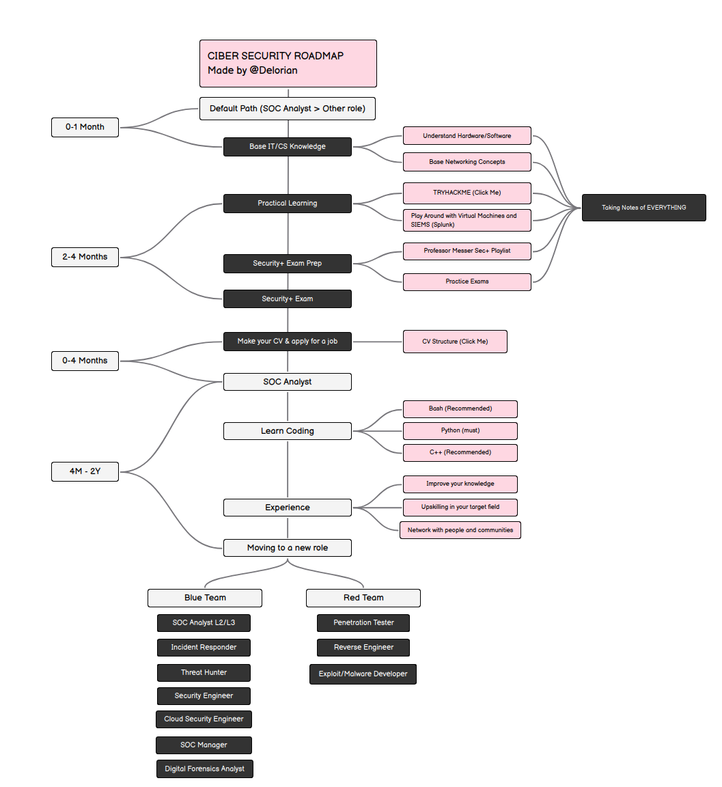

# My Cybersecurity Roadmap

Welcome to my personal cybersecurity roadmap repository.

I’m **Delorian**, the creator of the original roadmap on [roadmap.sh](https://roadmap.sh/r/cibersecurity-roadmap), and this repo contains my full expanded journey from zero knowledge to becoming a cybersecurity professional — both defensive (Blue Team) and offensive (Red Team).

## 🗺️ Original Visual Roadmap

You can view my interactive roadmap here:  
➡️ [roadmap.sh/r/cibersecurity-roadmap](https://roadmap.sh/r/cibersecurity-roadmap)

Also included as an image here:

## 📁 Roadmap Structure

The roadmap is split by time and skill development:

- `0-1-month/`: IT foundations, TryHackMe, SIEM tools, note-taking
- `2-4-months/`: Security+ prep with Professor Messer, certification, CV creation
- `4m-2y/`: SOC experience, coding (Python/Bash), networking, specialization
- `final-roles/`: Pathways for Blue Team and Red Team careers
- `resources/`: Study tools, cheat sheets, links, and books

👉 Read the full roadmap here: [roadmap.md](./roadmap.md)  
📄 View the CV structure: [cv.md](./cv.md)

## ✅ What This Roadmap Covers

- Step-by-step cybersecurity learning journey
- TryHackMe learning paths (Pre-Security, Cyber Security 101, SOC L1)
- Study strategy for CompTIA Security+ (with free resources)
- How to build a cybersecurity CV for SOC/Blue Team
- Guidance for entry-level job hunting and long-term growth
